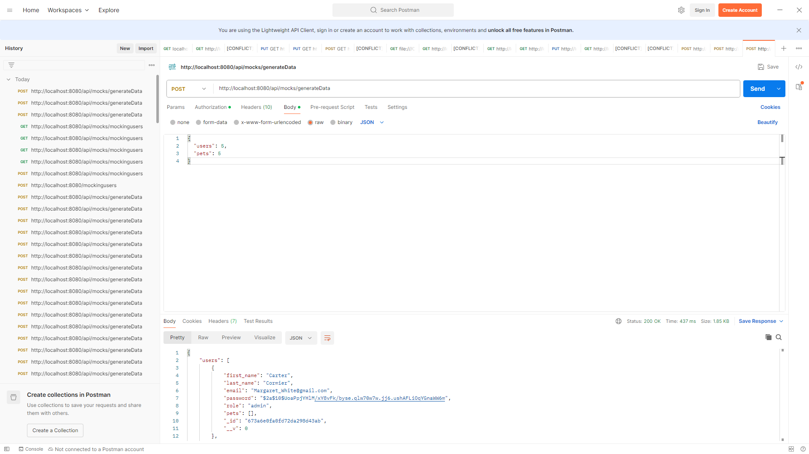
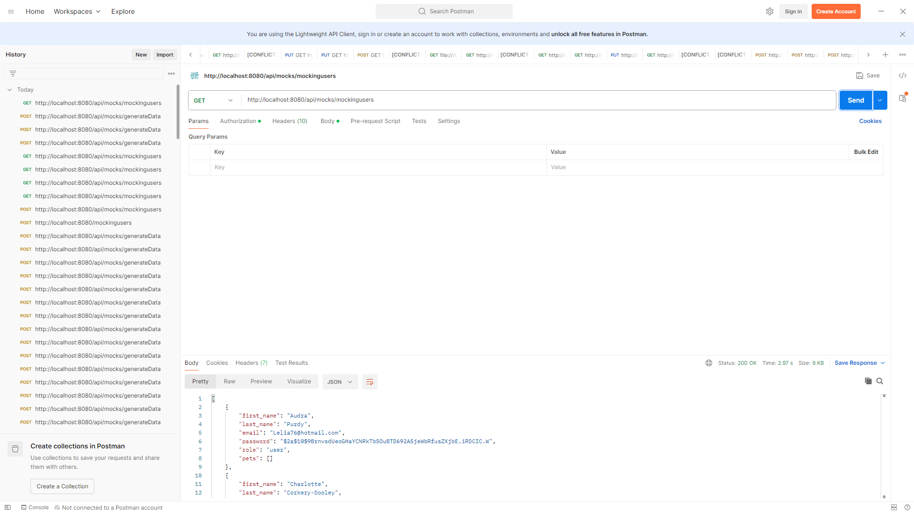
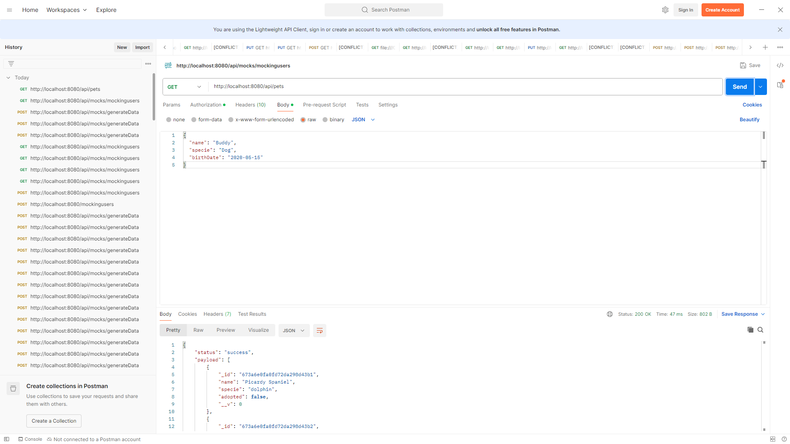

# API Mocking Users and Pets

Este proyecto proporciona endpoints para generar datos simulados para users and pets.

## Endpoints

### `/api/mocks/mockingusers`
- **Method**: `GET`
- **Description**: Genera 50 users simulados y los almacena en la base de batos.
- **Response**:
  ```json
  [
    {
      "first_name": "John",
      "last_name": "Doe",
      "email": "john.doe@example.com",
      "password": "$2a$10$...",
      "role": "user",
      "pets": []
    }
  ]

## Docker

El proyecto está dockerizado y puede ser ejecutado usando Docker.

### Imagen de Docker

Podés encontrar la imagen Docker de este proyecto en Docker Hub:

[Docker Image: criscioner/recursosbackend-adoptme:latest](https://hub.docker.com/r/criscioner/recursosbackend-adoptme)
